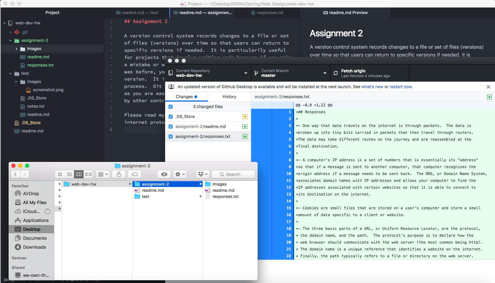

## Assignment 2

A version control system records changes to a file or set of files (versions) over time so that users can return to specific versions if needed.  It is particularily useful for projects that involve writing code because if you make a mistake or want to change something back to the way it was before, you can easily go back to the previous version.  It is a great way to document each step in your process.  Git version control also allows for collaboration as you are easily able to see what changes have been made by other contributors.

Please read my [responses](./responses.txt) regarding internet protocols and systems.

The experiences I gained from this assignment were:

- Practicing pushing changes to github and interacting with both github desktop and *github.com*.
- Learning more about how the internet actually works.
- Understanding how to effectively use github version control to enhance my projects.
- I didn't have many issues with this assignment since I have used github before, however, I couldn't initially figure out where to right click to make a new folder but I was able to figure it out easily by using google!

