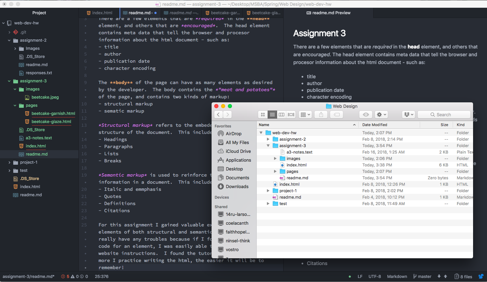

## Assignment 3

There are a few elements that are *required* in the **head** element, and others that are *encouraged*.  The head element contains meta data that tell the browser and procesor information about the html document - such as:
- title
- author
- publication date
- character encoding

The **body** of the page can have as many elements as desired by the developer.  The body contains the *"meat and potatoes"* of the page, and contains two kinds of markup:
- structural markup
- sematic markup

*Structural markup* refers to the embeded information about the structure of the document.  This includes:
- Headings
- Paragraphs
- Lists
- Breaks

*Semantic markup* is used to reinforce the meaning of the information in a document.  This includes:
- Italic and emmphasis
- Quotes
- Definitions
- Citations

For this assignment I gained valuable experience practicing elements of both structural and semantic markup. I didn't really have any troubles because if I forgot a specific line of code for an element, I was easily able to check back with the website instructions.  I found the tutorials valuable, and the more I practice writing the html, the easier it will be to remember!

