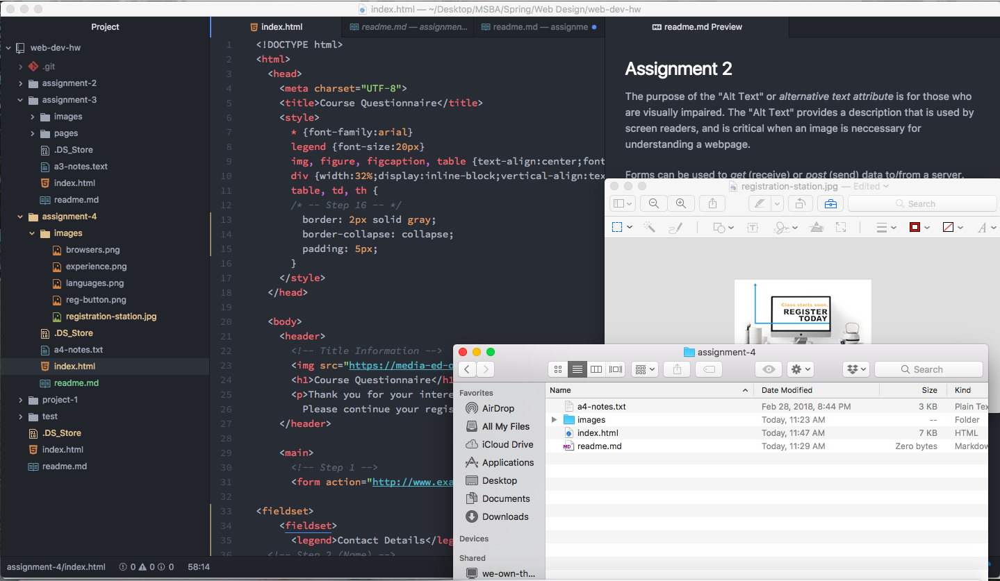

## Assignment 4

The purpose of the "Alt Text" or *alternative text attribute* is for those who are visually impaired.  The "Alt Text" provides a description that is used by screen readers, and is critical when an image is neccessary for understanding a webpage.

Forms can be used to *get* (receive) or *post* (send) data to/from a server.
One type of form that I encouter a lot when browsing the web are logins.  Logins are used to send data to the server so that you are directed to your own personal page.

For this assignment I learned a lot about forms and the different input elements that are associated with the function.  I found this assignment difficult because there was a lot of information to remember and I had to go back and look at the website tutorials multiple times.  I had one issue during my assignment where I forgot to close my `<figure>` tag the proper way.  I wrote `<figure/>` instead of `</figure>`, and I had to look at the code of some of the other students to finally figure out what I was doing wrong!
Overall, I learned a lot from this assignment!

