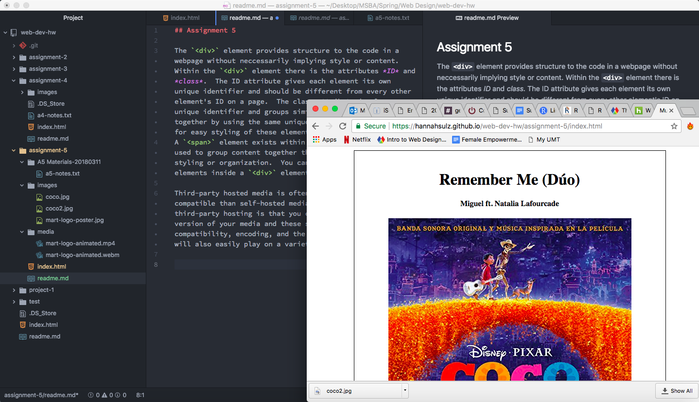

## Assignment 5

The `
` element provides structure to the code in a webpage without neccessarily implying style or content.  Within the `
` element there are the attributes *ID* and *class*.  The ID attribute gives each element its own unique identifier and should be different from every other element's ID on a page.  The class attribute is also a unique identifier and groups similar types of elements together by using the same unique class name.  This allows for easy styling of these elements with CSS code.
A `` element exists within a `
` element and is used to group content together that needs specific styling or organization.  You can have multiple `` elements inside a `
` element.

Third-party hosted media is often cheaper and more easily compatible than self-hosted media.  The advantage of third-party hosting is that you can upload a high-quality version of your media and these sites will often handle compatibility, encoding, and the other details.  The media will also easily play on a variety of browsers.

Overall I found this assignment informative but challenging.  I really enjoyed learning how to embed media such as Youtube videos and Google maps.  However, I found the Escape Characters difficult to understand and also had trouble with the `type` attribute of `source` for self-hosting the animation media.  I wanted to ask for help on the Github issues board; however, I ran out of time.

