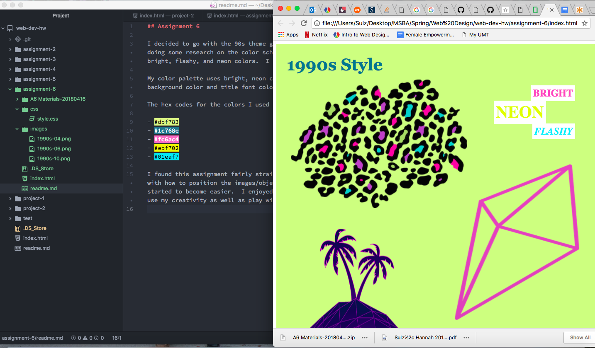

## Assignment 6

I decided to go with the 90s theme graphics because I liked them the best!  After doing some research on the color schemed from that era, I realized it was a lot of bright, flashy, and neon colors.  I tried to style my art page to reflect this.

My color palette uses bright, neon colors as well as a slightly more neutral background color and title font color.

The hex codes for the colors I used are as follows:

- #dbf783
- #1c768e
- #fc6ac4
- #ebf702
- #01eaf7

I found this assignment fairly straightforward; however, I was initially confused with how to position the images/objects on the page.  After some practice it started to become easier.  I enjoyed this assignment because I liked being able to use my creativity as well as play with colors!

