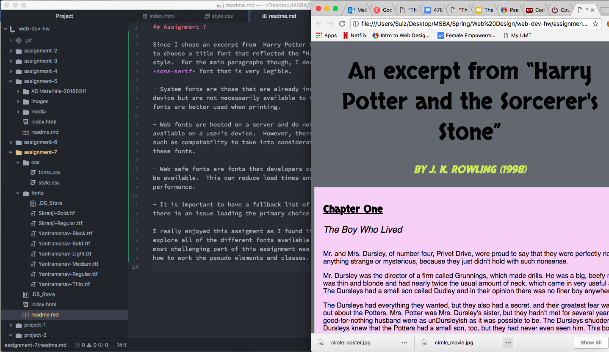

## Assignment 7

Since I chose an excerpt from  Harry Potter book I wanted to choose a title font that reflected the "Harry Potter" style.  For the main paragraphs though, I decided to use a *sans-serif* font that is very legible.

- System fonts are those that are already installed on your device but are not necessarily available to the web.  These fonts are better used when printing.

- Web fonts are hosted on a server and do not have to be available on a user's device.  However, there are issues such as compatability to take into consideration when using these fonts.

- Web-safe fonts are fonts that developers can count on to be available.  This can reduce load times and may increase performance.

- It is important to have a fallback list of fonts in case there is an issue loading the primary choice of font.

I really enjoyed this assigment as I found it fun to explore all of the different fonts available online!  The most challenging part of this assignment was figuring out how to work the pseudo elements and classes.

