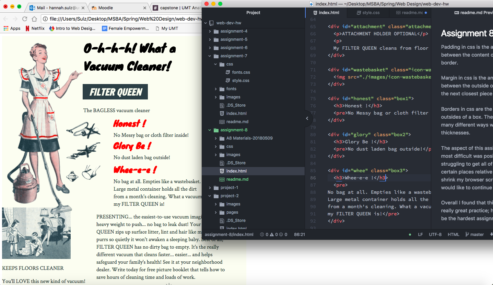

## Assignment 8

- Padding in css is the amount of space between the content within a box and the border.

- Margin in css is the amount of space between the outside of a box's border and the next closest piece of content.

- Borders in css are the lines that outline the outsides of a box.  They can be formatted in many different ways with styles, colors, and thicknesses.

The aspect of this assignment that I found most difficult was positioning.  I am still struggling to get all of my content to stay in certain places relative to each other when I shrink my browser screen.  It is something I would like to continue working on!

Overall I found that this assignment was really great practice; however, I found it to be the hardest assignment of the class!

