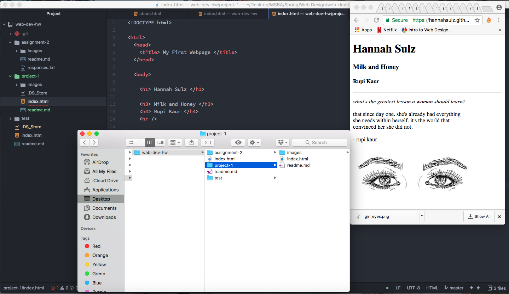

## Project 1

The main browsers that I use to surf the web are Google Chrome and Safari.
The main components of a browser are:
1. User interface (what is presented to the user to interact with)
2. Redering engine (responsible for displaying the visual representation of the webpage)
3. Browser engine (directs actions between the user interface and the rendering engine and external communication with servers)
4. Network (the browser asks for the neccessary images and documents that may help the page)
5. JavaScript programming language interpreter (applies interactive logic and functionality)
6. Data storage (cookies and local storage)

When interacting with the Wayback machine, I searched for *Nike.com*.  When I viewed a snapshot from the year 2000, the website was very retro-looking. Everything from the grapical elements to the text did not look as modern as the site today, and in the old webpage from 2000 there was a giant photo of Lance Armstrong!

The experiences I gained from this assignment were:

- Learning how to construct a basic webpage and use basic html, including structuring paragraphs the way I want them to appear in the webpage
- Learn how to use github *pages* to publish my repo as a website

One thing I struggled with initially in this assignment was sourcing an image to my web page.  The image I wanted to use was originally too big and I had to figure out how to make it smaller.  I also figured out that my relative url code was one "level" too high and therefore the image was not being displayed properly.  I posted about this issue in the github resources page, however, I figured it out on my own after using Google!

