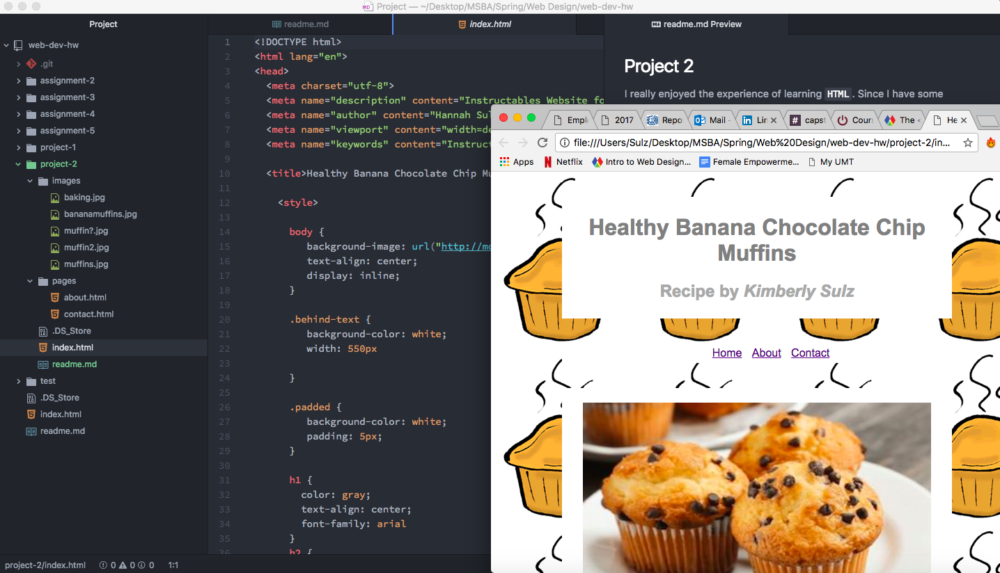

## Project 2

I really enjoyed the experience of learning `HTML`.  Since I have some previous coding experience in other languages, I found it easier to pick up; however, there still were some challenging sections regarding the topics of building forms and embedding media.

I am really looking forward to learning `CSS` in addition to `HTML` as I am really interested in the creative/design aspect of building web pages.

Overall I enjoyed this project as it gave me the chance to put everything I have learned so far together into one web page.  I did have to go back and review some topics as I went along, especially *tables* and *forms* as they are more complex.

